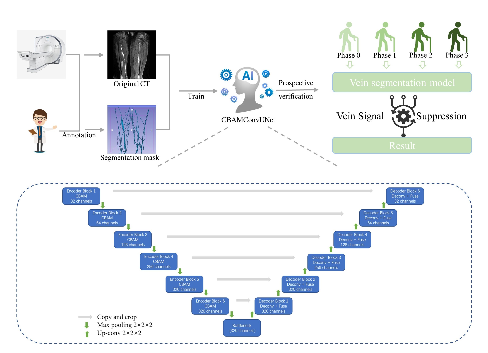
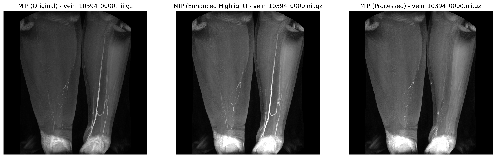
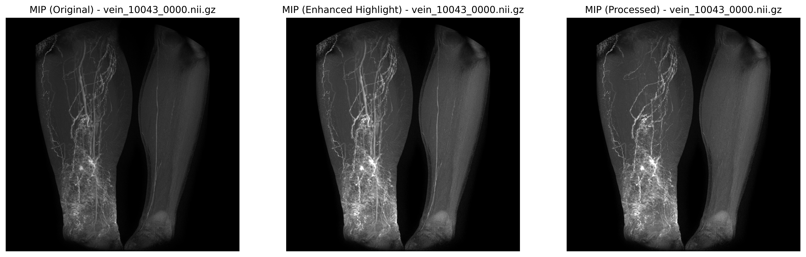
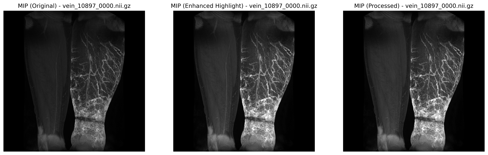

# LympClear: Deep Learning for Venous Signal Suppression in MR Lymphangiography

> Improving Diagnostic Precision for Lower Limb Lymphedema: Suppressing Vein Signal Interference Using Deep Learning in MR Lymphangiography

[](https://doi.org/10.xxxx/zenodo.xxxxxx) <!-- 可选：同步发布数据或代码时 -->

---



## 🧠 Overview

**LympClear** is a deep learning–based framework developed to suppress venous signal interference in Magnetic Resonance Lymphangiography (MRL), significantly enhancing diagnostic accuracy for **lower extremity lymphedema (LE)**. This project introduces a novel signal suppression approach, dynamic image generation pipeline, and a lymphatic development grading system to improve anatomical clarity and support clinical decision-making.

---

## 🔍 Background

MRL is widely used for LE diagnosis, but high-intensity venous signals often obscure lymphatic structures. LympClear solves this with a **brightness-matching enhanced nnUNet model**, enabling accurate vein suppression, improved visualization, and faster, more reliable interpretation.

---

## 🚀 Highlights

- 🧠 **Model**: Custom-trained nnUNet with brightness-matching strategy  
- 🧪 **Dataset**: 1022 patients, 6162 dynamic scans, multi-center, 2007–2024  
- 🎞 **Output**: Cleaned MRL, dynamic flow GIFs, structural grading  
- 📈 **Clinical Impact**: Faster reading, higher diagnostic consistency, more confident planning  

---

## 🎞 Dynamic Visualization Examples

> Below are dynamic MRL sequences generated with LympClear. Vein suppression enhances contrast flow clarity and supports temporal interpretation.

### Example 1


### Example 2


### Example 3


---

## 📊 Quantitative Results

| Metric                          | Before LympClear | After LympClear |
|---------------------------------|------------------|-----------------|
| Dice for vein segmentation      | N/A              | **0.940**       |
| Image quality (1–10)            | 6.7 ± 1.1        | **7.5 ± 0.9**   |
| Vein removal clarity            | 5.8 ± 1.2        | **8.8 ± 0.7**   |
| Lymphatic visibility            | 6.0 ± 1.3        | **8.3 ± 1.0**   |
| Radiologist reading time        | Baseline         | **↓ 87%**       |
| Reflux detection improvement    | -                | **↑ 18.7%**     |
| Missed diagnosis rate           | 15.4%            | **7.2%**        |
| Cohen’s Kappa (diagnostic κ)    | 0.65             | **0.91**        |

---

## 🧬 Methodology

<p align="center">
  
</p>

1. **Input**: 3D dynamic MRL scans  
2. **Preprocessing**: Normalization, registration, manual vein annotation  
3. **Training**: nnUNet with brightness matching  
4. **Output**:  
   - Vein-free MRL images  
   - Dynamic contrast agent flow GIFs   
   - Lymphatic development grading  

---

## 🧪 Lymphatic Development Grading System

> **Table x. Lymphatic Development Grading System**

| Grade       | Development Status     | Imaging Characteristics |
|-------------|------------------------|--------------------------|
| **Grade I** | Aplasia                | Extremely sparse or nearly invisible lymphatic signals; maximum vessel diameter is very small (<2 mm), branching density approaches zero, with almost no abnormal collateral circulation. |
| **Grade II**| Hypoplasia             | Continuous lymph vessels <5, maximum diameter between 2–3 mm, slightly reduced branching density, only very few abnormal collateral vessels. Relatively low dilation rate (<10%). |
| **Grade III**| Hyperplasia           | Continuous lymph vessels >7, increased diameter (e.g., ≥4 mm), with alternating segments of significant dilation or narrowing; increased branching density and presence of multiple abnormal collateral vessels; moderate or higher dilation rate (≥30%). |
| **Grade IV**| Severe Hyperplasia     | Highly dilated or clustered tortuous vessels, maximum diameter possibly >6 mm or larger; extremely high branching density, abundant abnormal collateral circulation; very high dilation rate (e.g., ≥50%), often accompanied by severe clinical symptoms. |


### Grade I: Aplasia
  
*Extremely sparse lymphatic signals, <2 mm in diameter, minimal branching.*

### Grade II: Hypoplasia
  
*Sparse vessels, slight dilation (2–3 mm), few abnormal collaterals.*

### Grade III: Hyperplasia
  
*Thickened and tortuous vessels (≥4 mm), moderate collaterals.*

### Grade IV: Severe Hyperplasia
  
*Severely dilated and clustered lymphatic network, extensive collateral flow.*


---

## 📦 Repository Structure

```bash
LympClear/
├── README.md                  # 项目介绍（本文件）
├── figures/                   # 模型结构图、流程图、分级图
├── gifs/                      # 动图展示
├── src/                       # 模型代码、训练和推理脚本
├── model/                     # 训练好的模型权重
├── dataset/                   # 数据说明或样例
├── notebooks/                 # 分析脚本或演示代码
├── requirements.txt           # 环境依赖
└── LICENSE
