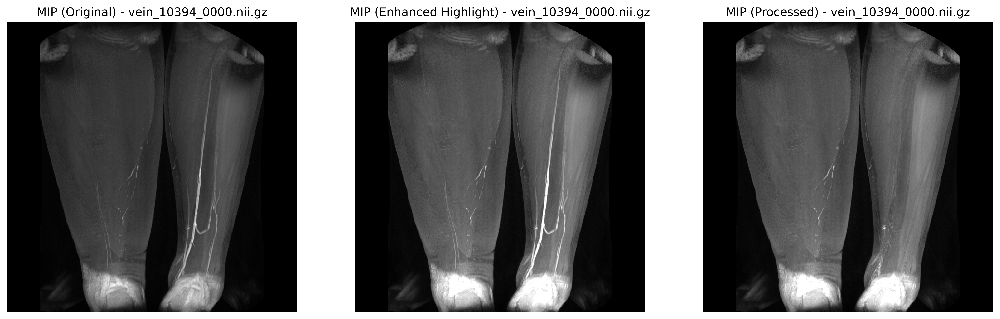

# LympClear

[](#installation)
[](LICENSE)
[](CHANGELOG.md)
[](#overview)

LympClear is a research-oriented deep learning framework for **venous signal suppression in MR lymphangiography (MRL)**.

> For research use only. This repository does **not** include raw clinical data or annotations. Pretrained model weights are distributed through **GitHub Releases**, not regular Git commits.

---

## Table of contents

- [Overview](#overview)
- [Highlights](#highlights)
- [Repository structure](#repository-structure)
- [Example outputs](#example-outputs)
- [Installation](#installation)
- [Quick start](#quick-start)
- [Model weights](#model-weights)
- [Expected data layout](#expected-data-layout)
- [FAQ](#faq)
- [Roadmap](#roadmap)
- [Citation](#citation)
- [Changelog](#changelog)
- [License](#license)
- [Acknowledgements](#acknowledgements)

## Overview

LympClear is designed to reduce venous signal interference in lower-extremity MR lymphangiography, improving downstream visualization of lymphatic structures for qualitative review and research analysis.

This repository currently focuses on:

- DICOM-to-NIfTI conversion for inference input
- nnUNet-based venous mask prediction workflow
- MIP generation for visual comparison
- GIF generation for qualitative presentation
- public-facing project organization for open-source release

## Highlights

- Cleaned command-line workflow for inference-related preprocessing and visualization
- Public-facing documentation suitable for GitHub release
- Apache-2.0 licensed for open-source distribution
- Safer repository defaults for medical-imaging projects via `.gitignore`
- Preserved original research scripts for traceability under `Data_preprocessing/`
- Added release notes, FAQ, citation metadata, changelog, and GitHub templates

## Repository structure

```text
LympClear/
├── .github/                        # issue / pull request templates
├── Data_preprocessing/             # original research scripts kept for traceability
├── dataset/                        # placeholder layout only; no clinical data included
├── docs/                           # release notes and extended documentation
├── Figures/                        # illustrative figures and demo media
├── models/                         # model architecture code
├── scripts/                        # cleaned command-line helper scripts
├── nnUNet/                         # vendored nnUNet snapshot
├── dynamic-network-architectures/  # vendored dependency snapshot
├── CHANGELOG.md
├── CITATION.cff
├── CONTRIBUTING.md
├── LICENSE
├── MODEL_ZOO.md
├── requirements.txt
└── README.md
```

## Example outputs

### MIP overview


### Example venous suppression comparison


## Installation

### 1. Create an environment

**Linux/macOS**
```bash
python -m venv .venv
source .venv/bin/activate
pip install -r requirements.txt
```

**Windows (PowerShell)**
```powershell
python -m venv .venv
.venv\Scripts\Activate.ps1
pip install -r requirements.txt
```

### 2. Install or expose nnUNet runtime

Depending on your local setup, ensure `nnUNetv2_predict` is available in your environment.

## Quick start

### Convert DICOM to NIfTI

```bash
python scripts/convert_dicom_to_nifti.py \
  --input-dir dataset/upload \
  --output-dir dataset/infer_nii
```

### Run nnUNet inference

```bash
nnUNetv2_predict \
  -d Dataset112_Vein \
  -i dataset/infer_nii \
  -o dataset/infer_result \
  -f 0 \
  -tr nnUNetTrainer \
  -c 3d_fullres \
  -p nnUNetPlans
```

### Generate MIP panels

```bash
python scripts/generate_mip.py \
  --image-dir dataset/infer_nii \
  --label-dir dataset/infer_result \
  --output-dir dataset/MIP
```

### Generate GIF preview

```bash
python scripts/build_gif.py \
  --image-dir dataset/MIP \
  --output dataset/GIF/lympclear_preview.gif
```

### One-command helper

```bash
bash scripts/run_inference.sh dataset/upload dataset Dataset112_Vein 0
```

## Model weights

Pretrained model weights are distributed via **GitHub Releases** rather than regular Git commits.

Please see the Releases page and [MODEL_ZOO.md](MODEL_ZOO.md) for download links and usage details.

## Expected data layout

```text
dataset/
├── upload/
│   ├── case_001/
│   ├── case_002/
│   └── ...
├── infer_nii/
├── infer_result/
├── MIP/
└── GIF/
```

Each folder under `dataset/upload/` is expected to contain one DICOM series.

For nnUNet-based inference, input NIfTI files should follow the standard naming convention, for example:

```text
case_001_0000.nii.gz
```

## FAQ

### 1. Does this repository include patient data?
No. This repository is structured for public release and does **not** include raw clinical data, labels, or annotations.

### 2. Does it include trained model weights?
Pretrained weights are provided separately through **GitHub Releases**, not through the normal repository history.

### 3. Which scripts should external users start with?
Use the cleaned scripts under `scripts/`. The `Data_preprocessing/` folder contains original research utilities kept mainly for traceability.

### 4. Can others reproduce the full paper results from this repository alone?
Usually not yet. Full reproducibility would additionally require standardized training instructions, model weights, dataset access policy, and exact experiment settings.

### 5. Should I keep the `Figures/` folder as-is?
Only after checking that all media are shareable, de-identified, and suitable for public release.

### 6. There is no paper yet. How should users cite this project?
Please cite this project as software using the metadata provided in `CITATION.cff`. A manuscript or preprint citation can be added later.

## Roadmap

- Add public checkpoint assets to GitHub Releases
- Add reproducible training guide
- Add de-identified demo examples if permitted
- Add automated smoke tests for scripts
- Add GitHub Actions workflow

## Citation

Please cite this repository as software using the metadata provided in `CITATION.cff`.

A manuscript or preprint citation can be added later when available.

## Changelog

See [CHANGELOG.md](CHANGELOG.md).

## License

This repository is released under the **Apache License 2.0**. See [LICENSE](LICENSE).

## Acknowledgements

This repository includes snapshots of upstream components such as nnUNet and dynamic-network-architectures. Their original licenses and attributions are preserved in the repository and should be respected in downstream use.
